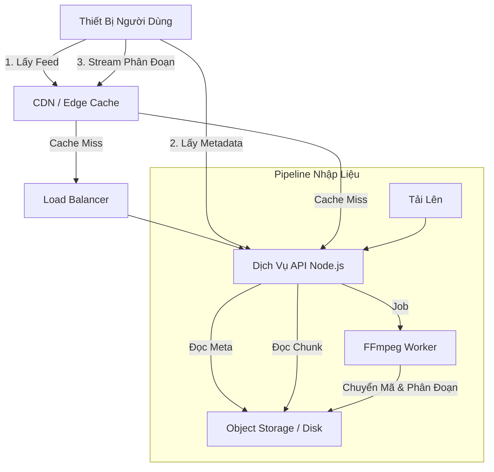
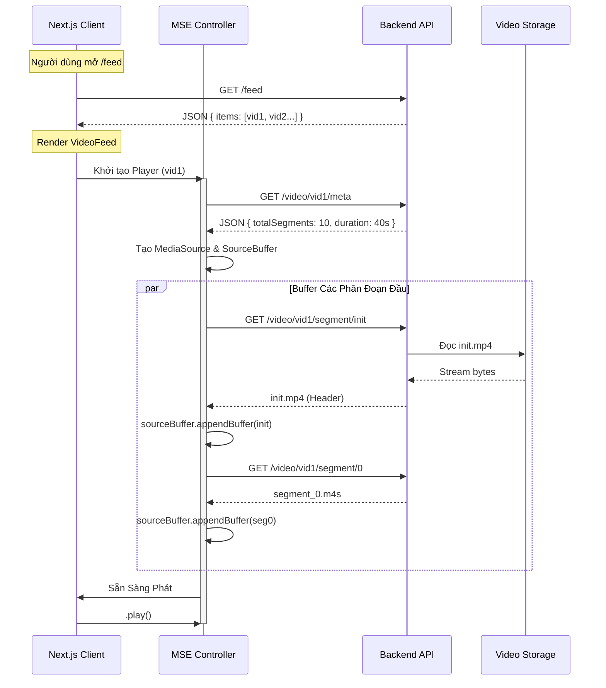

# Hệ Thống Streaming Video: Tài Liệu Kỹ Thuật & Luồng Dữ Liệu

## 1. Tổng Quan Hệ Thống

Tài liệu này chi tiết hóa kiến trúc và luồng dữ liệu của một hệ thống streaming video ngắn hiệu năng cao, tương tự như TikTok. Hệ thống được thiết kế cho việc phát lại với độ trễ thấp, thời gian bắt đầu tức thì và cuộn dọc mượt mà.

### Các Thành Phần Cốt Lõi

*   **Frontend (Client)**:
    *   **Framework**: Next.js 14 (App Router) để render phía server (SSR) cho app shell và hydration phía client cho feed tương tác.
    *   **Player Engine**: `xgplayer` được bọc bởi một bộ điều khiển Media Source Extensions (MSE) tùy chỉnh.
    *   **Quản Lý Trạng Thái**: React State để ảo hóa danh sách feed (virtualization) và theo dõi video đang hoạt động.
*   **Backend (Server)**:
    *   **Lớp API**: Node.js (Fastify) phục vụ các REST endpoint.
    *   **Xử Lý Video**: Pipeline FFmpeg chuyển mã và phân đoạn các file MP4 thô thành các chunk fMP4 (Fragmented MP4).
    *   **Lưu Trữ**: Hệ thống file cục bộ (mô phỏng Object Storage/S3) lưu trữ các phân đoạn và playlist đã xử lý.

### Kiến Trúc Cấp Cao



---

## 2. Quy Trình Luồng Video Từng Bước

Phần này chi tiết hóa vòng đời chính xác của một phiên phát video, từ lúc người dùng mở feed đến khi video phát và cuộn sang video tiếp theo.

### Biểu Đồ Tuần Tự: Khởi Tạo Phát Lại



### Luồng Dữ Liệu Chi Tiết

#### Giai Đoạn 1: Khởi Tạo Feed
1.  **Yêu Cầu Feed**: Client yêu cầu `/feed`. Server quét các video đã xử lý và trả về danh sách JSON nhẹ chứa ID Video, Tiêu đề và metadata cơ bản.
2.  **Ảo Hóa (Virtualization)**: Component `VideoFeed` render một danh sách ảo. Chỉ video đang hiển thị và các video lân cận (trước/sau) mới được render trong DOM để tiết kiệm bộ nhớ.

#### Giai Đoạn 2: Thiết Lập Player (Video "Đang Hoạt Động")
1.  **Mount Component**: Component `MSEPlayer` mount cho video đang hoạt động.
2.  **Tạo MediaSource**: Một đối tượng `MediaSource` được tạo và gắn vào thẻ `<video>` thông qua `URL.createObjectURL()`.
3.  **SourceOpen**: Khi sự kiện `sourceopen` kích hoạt, một `SourceBuffer` được tạo.
    *   *Đàm Phán Codec*: Chuỗi codec (ví dụ: `video/mp4; codecs="avc1.64001f, mp4a.40.2"`) rất quan trọng. Nó phải khớp với đầu ra mã hóa của job FFmpeg.

#### Giai Đoạn 3: Buffering & Phát Lại
1.  **Hàng Đợi Phân Đoạn**: Player duy trì một hàng đợi các phân đoạn cần tải (ví dụ: `[init, 0, 1, 2]`).
2.  **Tải Tuần Tự**:
    *   **Phân Đoạn Init**: `init.mp4` (moov atom) được tải trước tiên. Nó không chứa dữ liệu video nhưng định nghĩa timescale, track và thời lượng.
    *   **Phân Đoạn Media**: `segment_0.m4s`, `segment_1.m4s`, v.v., được tải tuần tự.
3.  **Nối Buffer (Appending)**: Khi mỗi chunk về, nó được nối vào `SourceBuffer`.
    *   *Kiểm Soát Luồng*: Player đợi sự kiện `updateend` trên buffer trước khi nối chunk tiếp theo để tránh lỗi `QuotaExceededError`.
4.  **Bắt Đầu Phát**: Khi `segment_0` đã được buffer, video sẵn sàng phát. Nếu người dùng đang xem video này, `video.play()` được gọi.

#### Giai Đoạn 4: Tải Trước (Preloading) & Tối Ưu Hóa Cuộn
1.  **Prefetching**: Trong khi `vid1` đang phát, component `VideoFeed` xác định `vid2` là video "tiếp theo".
2.  **Tải Nền**: Một `MSEPlayer` ẩn hoặc một loader độc lập bắt đầu tải `init.mp4` và `segment_0.m4s` của `vid2`.
3.  **Chuyển Đổi Tức Thì**: Khi người dùng cuộn đến `vid2`:
    *   Buffer đã tải trước đã sẵn sàng.
    *   `vid1` bị tạm dừng.
    *   `vid2` bắt đầu phát ngay lập tức (cảm giác độ trễ 0ms).

#### Giai Đoạn 5: Dọn Dẹp Bộ Nhớ (Garbage Collection)
1.  **Giải Phóng Buffer**: Trình duyệt tự động xử lý một phần, nhưng với các phiên xem dài, bộ điều khiển tùy chỉnh nên xóa thủ công các phạm vi đã phát (ví dụ: `sourceBuffer.remove(0, currentTime - 30)`) để giải phóng bộ nhớ.
2.  **Dọn Dẹp DOM**: Khi video cuộn xa khỏi tầm nhìn, component của chúng bị unmount. `MediaSource` được đóng và `URL.revokeObjectURL()` được gọi để ngăn rò rỉ bộ nhớ.

---

## 3. Quy Trình Backend & Xử Lý

### Pipeline Nhập Liệu Video

Backend chịu trách nhiệm chuyển đổi video thô người dùng tải lên thành các chunk sẵn sàng để stream.

1.  **Tải Lên**: Người dùng POST một file video (ví dụ: `raw_video.mp4`).
2.  **Kiểm Tra**: Server kiểm tra mime-type và tính toàn vẹn của file.
3.  **Hàng Đợi Job**: Tác vụ xử lý được thêm vào hàng đợi (in-memory cho demo này, Redis/BullMQ trong thực tế).
4.  **Xử Lý FFmpeg**:
    *   **Lệnh**:
        ```bash
        ffmpeg -i input.mp4 \
          -c:v libx264 -g 48 -sc_threshold 0 \
          -f hls -hls_time 4 -hls_playlist_type vod \
          -hls_segment_type fmp4 \
          -hls_segment_filename segment_%d.m4s \
          output.m3u8
        ```
    *   **Tham Số Chính**:
        *   `-g 48`: Đặt kích thước Group of Pictures (GOP). Ở 24fps, điều này có nghĩa là một keyframe mỗi 2 giây. Điều này quan trọng cho việc tua và phân đoạn chính xác.
        *   `-sc_threshold 0`: Tắt phát hiện chuyển cảnh. Điều này buộc FFmpeg tuân thủ nghiêm ngặt kích thước GOP, đảm bảo các phân đoạn có thời lượng bằng nhau chính xác.
        *   `-hls_segment_type fmp4`: Tạo Fragmented MP4 thay vì MPEG-TS cũ. fMP4 hiệu quả hơn cho các trình duyệt hiện đại và MSE.

### Các Endpoint API

| Endpoint | Method | Mục Đích | Phản Hồi |
| :--- | :--- | :--- | :--- |
| `/feed` | GET | Danh sách video khả dụng | `[{ id, title, duration, ... }]` |
| `/video/:id/meta` | GET | Metadata kỹ thuật | `{ totalSegments, segmentDuration, codecs }` |
| `/video/:id/segment/:idx` | GET | Chunk video nhị phân | `video/mp4` binary stream |
| `/video/:id/stream` | GET | Stream dự phòng | Phản hồi HTTP Range chuẩn |

### Chiến Lược Caching

*   **Phân Đoạn (`*.m4s`)**: Các file này là **bất biến (immutable)**. Một khi đã tạo, `segment_0.m4s` cho một phiên bản video cụ thể không bao giờ thay đổi.
    *   *Header*: `Cache-Control: public, max-age=31536000, immutable`
    *   *CDN*: Có thể cache vĩnh viễn tại Edge.
*   **Feed (`/feed`)**: Thay đổi liên tục.
    *   *Header*: `Cache-Control: no-cache` hoặc `max-age` ngắn (ví dụ: 60s).
*   **Metadata (`/meta`)**: Bán tĩnh.
    *   *Header*: `Cache-Control: public, max-age=3600`.

---

## 4. Xử Lý Lỗi & Khả Năng Phục Hồi

### Lỗi Mạng
*   **Logic Thử Lại**: Nếu việc tải phân đoạn thất bại (5xx hoặc Lỗi Mạng), client thử lại 3 lần với thời gian chờ tăng dần (ví dụ: 500ms, 1s, 2s).
*   **Giảm Chất Lượng (ABR)**: Nếu các phân đoạn chất lượng cao bị lỗi hoặc tải quá chậm, player chuyển sang yêu cầu phân đoạn từ track độ phân giải thấp hơn (ví dụ: `720p` -> `480p`). *Lưu ý: Điều này yêu cầu backend phải xử lý nhiều phiên bản độ phân giải.*

### Phân Đoạn Bị Thiếu
*   Nếu một phân đoạn cụ thể (ví dụ: `segment_5`) trả về 404, player cố gắng bỏ qua đến `segment_6` và tua đầu đọc video về phía trước, thay vì bị kẹt vô thời hạn.

### Hạn Chế Trình Duyệt
*   **Chính Sách Tự Động Phát**: Trình duyệt chặn tự động phát có âm thanh. Player mặc định là `muted=true` để đảm bảo tự động phát hoạt động khi cuộn. Một nút gạt UI cho phép người dùng bật tiếng.
